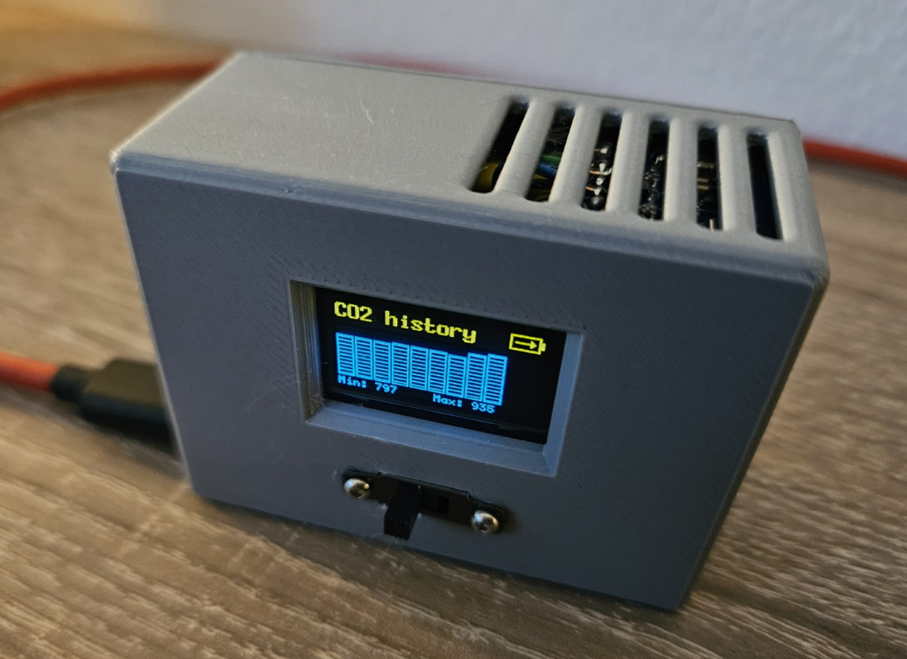
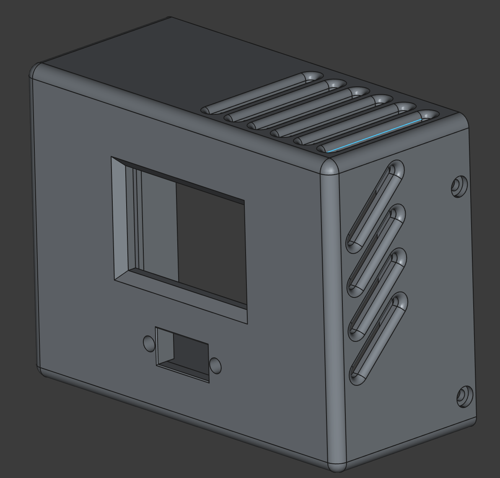
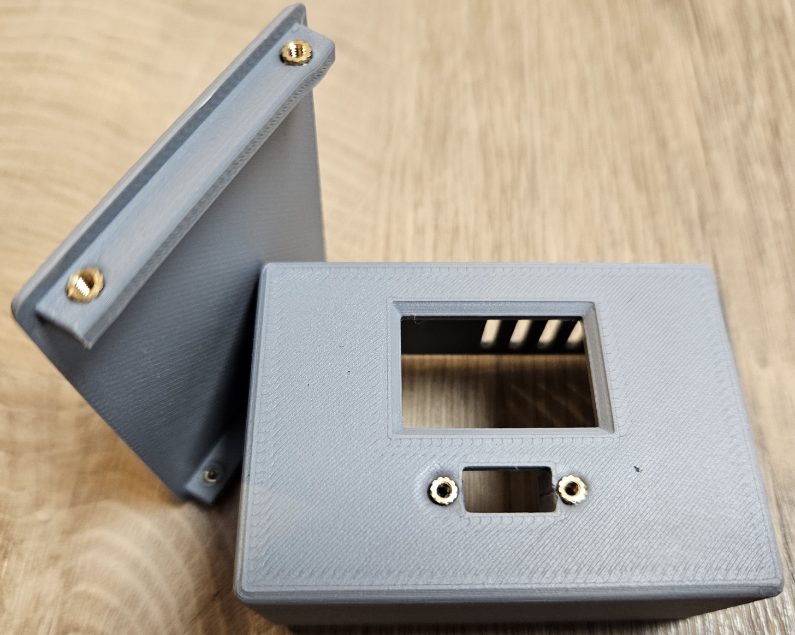

# Air Quality Monitor

A compact, battery-powered air quality monitoring device built with Rust and a Waveshare RP2350-based board. This device continuously monitors air quality, temperature, and humidity with a small OLED display.

**⚠️ Educational Project Notice**: This is a hobby project developed for educational purposes only.

## Finished Device

<table>
<tr>
<td></td>
<td></td>
</tr>
</table>

## How It Works

1. **Sensor Reading**: Collects data from ENS160 (air quality) and AHT21 (temperature/humidity) sensors every 5.5 minutes
2. **Data Processing**: Uses median filtering on air quality readings to reduce noise
3. **Display Updates**: Shows current readings and battery status on a 128x64 OLED display, changing between data and bar graph views every 10 seconds
4. **Power Management**: Reduced clock speed (18MHz) and core voltage to conserve power. Sends ENS160 to sleep mode when not reading data. The device consumes around 25-27mA on average, so the device can run for several days on a 2500mAh battery.
5. **Battery Monitoring**: VSYS voltage is measured every 4 seconds to determine battery level and charging state. Uses moving median filtering (5 samples) when on battery power for stable readings, and direct measurements when charging to reduce latency.

## Components

| Component | Description | Purpose |
|-----------|-------------|---------|
| Waveshare RP2350 Board | RP2350-based development board. There are cheaper alternatives available on AliExpress, so long as they have the Pico 2 form factor and a battery connector with charger it should be fine | Core processing and I/O |
| ENS160 + AHT21 Module | Combined air quality and temperature/humidity sensor board. There are cheap combined boards available | Environmental monitoring |
| SSD1306 | 128x64 OLED Display, yellow/blue in my case here but monochrome or blue will work just as well | Data visualization |
| LiPo Battery | 3.7V rechargeable battery. I use 2500mA, 7 x 40 x 60mm with a 1.25mm connector | Portable power source |
| Slide Switch | Slide switch to control power | Power management |

## Hardware Connections

Connect the components to the Waveshare RP2350 board as follows:

### I2C Bus (Shared)

All I2C devices (ENS160 + AHT21 module and SSD1306 display) connect to the same I2C bus.
Since ENS160 and AHT21 are on the same module, they share the bus anyway and the SSD1306 display is also connected to the same I2C bus for simplicity.

### ENS160 + AHT21 Module

- **VCC**: 3.3V
- **GND**: Ground
- **SDA**: GPIO 16
- **SCL**: GPIO 17
- **INT**: GPIO 18 (ENS160 interrupt pin)

### SSD1306 OLED Display

- **VCC**: 3.3V
- **GND**: Ground
- **SDA**: GPIO 16
- **SCL**: GPIO 17

### Power Monitoring

Power and charging detection is handled through VSYS voltage monitoring due to RP2350 E9 erratum affecting VBUS detection.

- **VSYS**: GPIO 29 (Battery voltage monitoring via ADC and charging detection)

### Battery

- **Battery**: 3.7V LiPo battery connected to the battery connector on the Waveshare board.

The Waveshare board has built-in battery charging and power management, so no additional components are required.
In case you want to use i.e. a Pi Pico 2, you need to add a charger board and appropriate circuit. The Pi Pico 2 datasheet has instructions.

## Assembly and Enclosure

### Electronics Assembly

Wire the components according to the hardware connections above. For the slide switch, cut the ground wire of the battery connector and connect it to the switch.

<table>
<tr>
<td></td>
</tr>
</table>

### 3D-Printed Enclosure

The device features a custom 3D-printed enclosure.

**3D Print Files**: All enclosure files are available in the [`enclosure/`](./enclosure/) directory:

- `Main Body.3mf` - Main housing with sensor openings
- `Back Lid.3mf` - Battery compartment cover
- `EnclosureComplete.FCStd` - Body FreeCAD file
- `Back Lid.FCStd` - Back lid FreeCAD file

<table>
<tr>
<td></td>
<td></td>
</tr>
</table>

### Enclosure Assembly

After printing the enclosure parts, assemble the electronics into the housing. The main body provides openings for sensor airflow while protecting the internal components.

<table>
<tr>
<td></td>
</tr>
</table>

## Code Structure

The firmware is built using Embassy (async Rust) and organized into modular tasks:

```text
src/
├── main.rs          # Entry point, hardware initialization, task spawning
├── sensor.rs        # ENS160 and AHT21 sensor data acquisition
├── display.rs       # SSD1306 OLED display management and UI rendering
├── event.rs         # Inter-task communication events
├── orchestrate.rs   # Main control loop and data coordination
├── system_state.rs  # System state management (battery, sensor data, display modes)
├── vsys.rs          # Battery voltage monitoring and charging detection
├── watchdog.rs      # System watchdog
└── media/           # Bitmap assets for display (battery icons, etc.)
```

### Key Features

- **Async Architecture**: Uses Embassy framework for task scheduling
- **Power Optimization**: 18MHz clock, voltage scaling, and idle modes
- **Median Filtering**: Reduces sensor noise through statistical processing
- **Battery Monitoring**: VSYS-based voltage tracking with adaptive filtering (median filtering on battery, direct measurement when charging)
- **Charging Detection**: Automatic detection of charging state via voltage thresholds (works around RP2350 E9 erratum)
- **Mode Switching**: Automatic display cycling between sensor data and CO2 history views

## Building and Flashing

```bash
# Build for release (optimized for size and power)
cargo build --release

# Option 1: Flash directly with picotool (elf2uf2-rs does not support RP2350 as of 06.2025)
# Put board in bootloader mode (hold BOOTSEL while connecting USB)
picotool load -u -v -x -t elf target/thumbv8m.main-none-eabihf/release/air-quality-monitor

# Option 2: Convert to UF2 and copy manually
picotool uf2 convert target/thumbv8m.main-none-eabihf/release/air-quality-monitor -t elf air-quality-monitor.uf2 -t uf2
# Copy the resulting .uf2 file to the RP2350 board in bootloader mode
```

For development builds probe-rs can be used:

```bash
# Build for development
cargo build
# Flash using probe-rs
cargo run
```

## License

This project is licensed under either of:

- [Apache License, Version 2.0](LICENSE-APACHE)
- [MIT License](LICENSE-MIT)

at your option.
